# Digital Finder Scopes

### Finding Your Way Around the Night Sky
#### What is available out there today and how they work

**John Paul Aguirre**
Charlie Elliott Astronomy · May 16, 2026

<!--
Welcome everyone.
-->

---
# About me
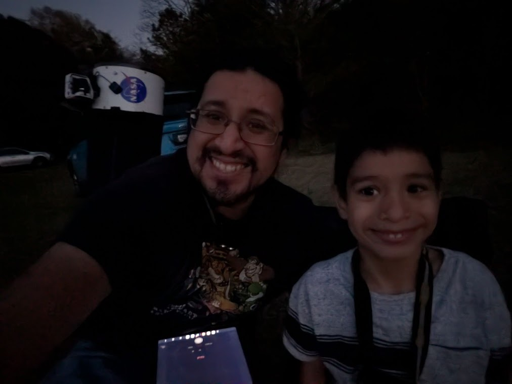

<!--
I am John Aguirre, an amateur astronomer. Joining me today is my wife Maritza Aguirre and my 2 kids, David and Simon. My background has been in satellite communications with the Army Reserve and software engineering. I have spent many very long nights next to a satellite terminal troubleshooting and counting stars to pass the time. 
-->
---

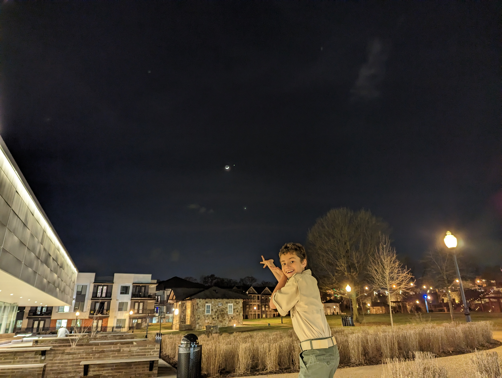

---

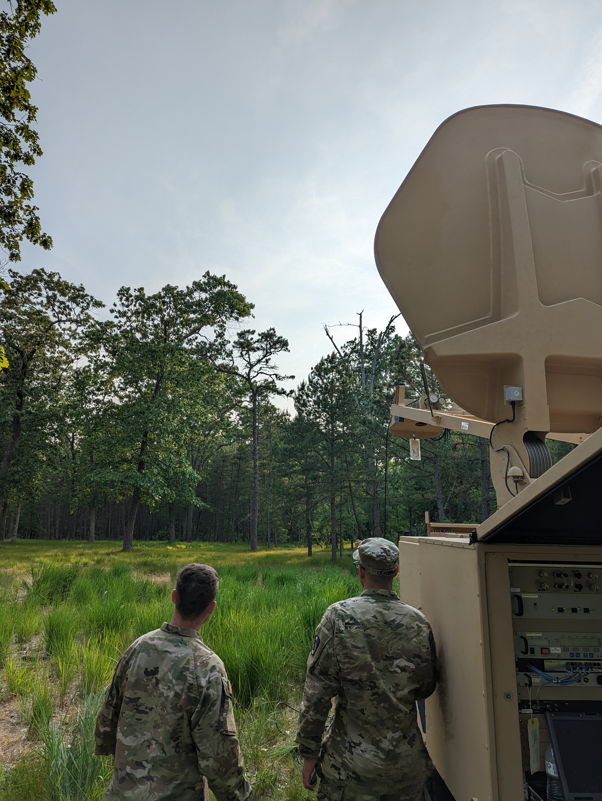

---

## What We'll Cover Tonight

- **Finding our way around the sky** — analog finders, encoder kits, and plate solving eFinders.
- **The commercial landscape** — PiFinder, Hopper, Nexus eFinder, and DIY options
- **My PiFinder build** — why I chose it, how it went, lessons learned
- **How plate solving actually works** — the cool computer science behind the magic
- **How PiFinder does it** — tetra3, cedar-solve, and the IMU trick

<!--
We'll move through this in order, but feel free to stop me with questions anytime.
-->

---

## Traditional Finders Are Great… Until They Aren't
- **RACI finders** — magnified, upright view; great for star-hopping with an atlas
- **Telrad** — concentric circles match star chart overlays; both eyes open
- **Red dot finders** — simple, light, universal — every beginner scope ships with one

All three require you to *already know the sky*

Bright showpiece objects? No problem.
Kids patiently waiting while you try to star hop your way into something cool? Pain.

|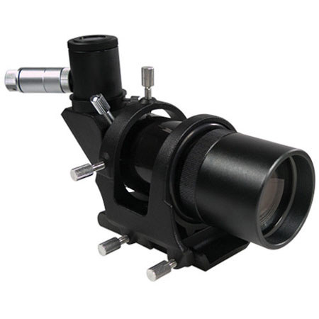|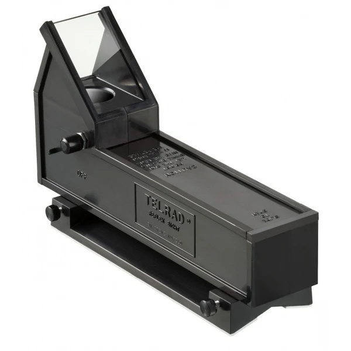||


<!--

These are all great tools. As I learned the night sky I find that these methods are superior in their simplicity but as a beginner the challenge can be overwhelming. I still have a Telrad on my scope alongside the PiFinder. The problem isn't that they're bad — it's that they require YOU to already know the sky well enough to navigate.
-->

---

## Encoder Kits & Digital Setting Circles

Rotary encoders on altitude and azimuth axes track scope motion mechanically.
A handheld DSC reads encoder ticks → push-to arrows on screen.

**What's great:** no motors, works on any Dob, SkySafari integration

**The catch:**

- Requires a 2–3 star alignment **every session**
- Bump the scope? Re-align.
- Scope-specific machined kits — hard to move between telescopes
- Total cost (kit + DSC) can hit **$400–$600+**


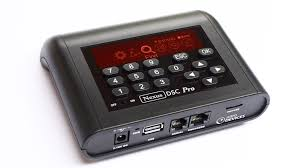


<!--
Encoder kits are a real step forward from purely analog finders — they let you push the scope around and get directional guidance without memorizing star charts. The Nexus DSC and Pushto.me systems are genuinely great products

Encoders measure HOW FAR you've moved from a known starting point. If that starting point is wrong — everything else starts to be off.
-->

---

## Phone Based Apps

Apps like **SkySafari**, **Stellarium**, and **Sky Map** use your phone's built-in compass, GPS, and gyroscope to overlay the sky and give rough pointing guidance. This is great for star hopping and generally finding your way around the sky.

**Celestron StarSense Explorer** uses the actual camera on your cellphone and a bracket to plate solve its way around the sky.

**Concerns:**
- Phone compass is unreliable near metal telescope parts
- Battery drain and screen brightness are real concerns at the eyepiece


<!--

The StarSense Explorer is worth calling out specifically because it's the first mainstream consumer product to bring plate solving to a phone. You clip it on, point at something, and it tells you what you're looking at. Clever idea!

-->

---

## What Is a Plate-Solving eFinder?

This class of products looks at the sky and asks:

**"Where am I pointing right now?"**

1. Camera photographs the sky
2. Software detects star positions in the image
3. Compares star patterns to a catalog → identifies the field
4. Reports RA/Dec — instantly, from first principles

This is called **lost-in-space** solving — it works with zero prior pointing knowledge.

<!--
The fundamental difference here is the question being asked. Encoders ask "how far have I moved from where I started?" A plate-solving eFinder asks "where am I right now?"

It takes a picture of whatever patch of sky it's looking at, finds the stars in that image, and matches their pattern against a pre-built catalog. No starting reference needed. The sky itself is the reference.

This is the same technology used on spacecraft — the ESA algorithm we'll talk about later was literally designed to figure out where a satellite is pointing in deep space, with no prior knowledge at all.
-->

---

## Positives using a eFinder

-  Power on, point anywhere 
- Auto-corrects on next solve 
- Direct sky measurement every frame 
- Any scope with a finder shoe 
- Can't *stay* lost 

<!--

I set up at a dark site, power on the PiFinder, and within about a second after gps lock it knows exactly where I'm pointing. As someone that advocates keeping things as simple as possible while your feet touch grass I really like this type of device.
-->

---

## The Options

||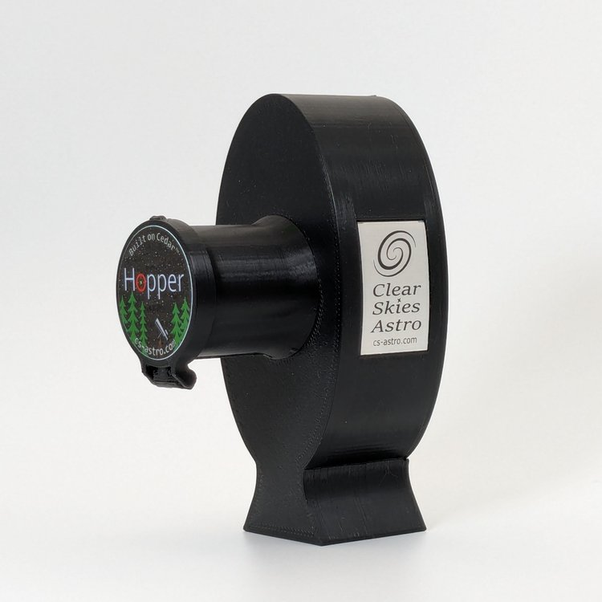|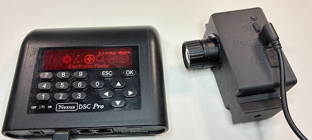|
|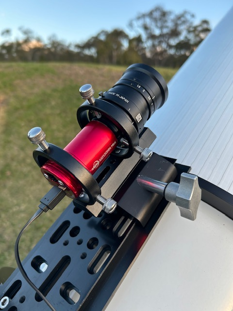||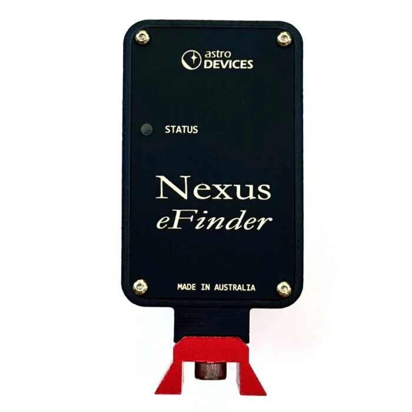 |
<!--
Let's look at what's actually on the market right now. This landscape has changed a lot since I decided on building a pifinder — when I started looking, the PiFinder was really the only commercial plate-solving eFinder. Now there are several.
-->

---

## PiFinder — pifinder.io

Encoderless Pointing and Push-To

- Open-source, Raspberry Pi-based; created by Richard Sutherland
- Solver: **Tetra3 / Cedar-Solve**
- Hardware: Pi + HQ Camera + 1.5" OLED + keypad + IMU
- Built-in catalog; observing log, star chart, eyepiece simulation

| Option | Cost |
|--------|------|
| Fully assembled (v2, with GPS) | ~$440–$540 |
| DIY kit | $15–$395 |
| Scratch build | BOM + 3D files on GitHub |


<!--
The PiFinder is what I ended up building, so I'll spend more time on it later. The key hardware is a Raspberry Pi, an HQ camera module, a small OLED screen, a keypad, and an Inertial Measurement Unit chip.
-->

---

## PiFinder — Pros & Cons

<style scoped>
.columns { display: grid; grid-template-columns: 1fr 1fr; gap: 1.5em; }
</style>

<div class="columns">
<div>

**PROS**
- No alignment — true lost-in-space
- Self-contained: screen + catalog on device, no phone required
- Fully open source: hardware, software, PCB files, 3D models
- Active Discord community + ongoing development
- Works on any push-to scope

</div>
<div>

**CONS**
- DIY build requires soldering/3D printing
- Small 1.5" OLED can be hard to read at arm's length
- Slow solves (5–30 s) in very dim or difficult skies
- No GoTo / motorized mount integration
- Assembled units are $440–$540

</div>
</div>

<!--
More cons:
The OLED screen is really small.
 In cold weather with gloves on, it is a pain to push buttons. 

The DIY build is a project if you go that route. Soldering, 3D printing, software setup
-->

---

## Hopper eFinder — cs-astro.com

- Designed and 3D-printed in the USA by **Clear Skies Astro**
- Solver: **Cedar** (same European Space Agency derived engine as PiFinder)
- 80 g body — extremely light; fits any standard finder shoe
- Connects your phone via its own Wi-Fi hotspot 
- **Cedar Aim app** provides push-to arrows + catalog and compatible with SkySafari Plus/Pro v7

Pricing: $350.00

**Key difference from PiFinder:** No onboard screen, have to use your phone, no IMU so have to wait for a plate solve. No battery


<!--

It creates its own Wi-Fi hotspot in the field and has an app. 
-->

---

## Nexus eFinder — astrodevices.com

- From **Astro Devices** (Australia), makers of the popular Nexus DSC
- Part of their ecosystem - plugs into the **Nexus DSC Pro** via USB-C for continuous positioning
- Compatible with **ServoCat** and **SkyTracker** motor systems

**The catch:** Requires the **Nexus DSC Pro** (sold separately, ~$250–$350)
Total system cost: **$600–$700+**


<!--
Astro Devices has absolutely amazing hardware for people sitting next to an eyepiece and they are popular for a reason. This extends their handheld and looks amazing.  Same as the Hopper where no onboard screen, no onboard battery and no IMU so you have to wait for it to solve the image.
-->

---

## DIY Options — For the Brave

**AstroKeith eFinder Lite** — astrokeith.com
- Pi Zero 2 W + HQ Camera + Tetra3 — same solver as PiFinder
- ~$65–$100 in parts; relays position over Wi-Fi to SkySafari
- Fully open source — no PCB, no kit, just build it yourself


<!--
very cheap, no IMU, needs phone , very low powered due to the pi zero, needs power. Continuously sends its position to something like sky safari on your phone
-->

---

**SkySOLVE** — github.com/githubdoe/skysolve
- Raspberry Pi + HQ Camera; web UI + SkySafari TCP/IP integration
- Pi acts as its own hotspot at dark sites
- ~0.8–10 s solve latency; simpler concept, less polished UX


<!--
very cheap, no IMU, needs phone , better processing power due to raspberry pi 4, needs power. It also continuously sends its position to something like sky safari on your phone
-->
---

## Why I Chose the PiFinder

A few things pushed me toward the PiFinder:

- Much like many of you I spent an amazing amount of time trying to find objects. When you start off initially the knowledge cliff is very steep. 
- I wanted something self-contained.
- The open-source nature appealed to me — I spent a good amount of time replicating the functionality with a finder scope and a ASI120mm

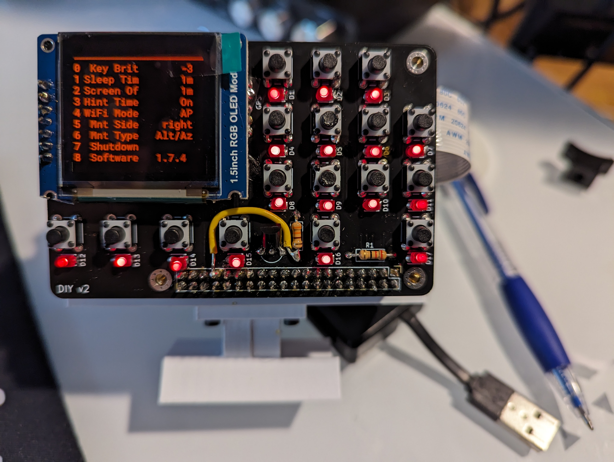
<!--
Not sure if it is obvious but I love the DIY aspect of the hobby. At the time these software libraries were very new and allowed for this type of plate solving. I had a few pcb projects at the time so wanted to add this to the hobby. 
-->

---


---


---


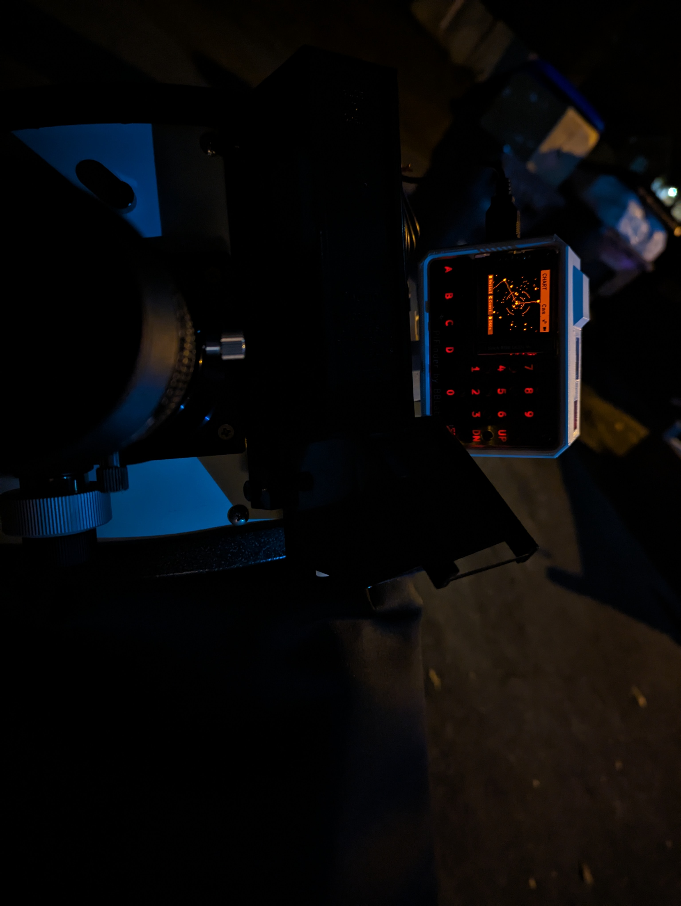

---

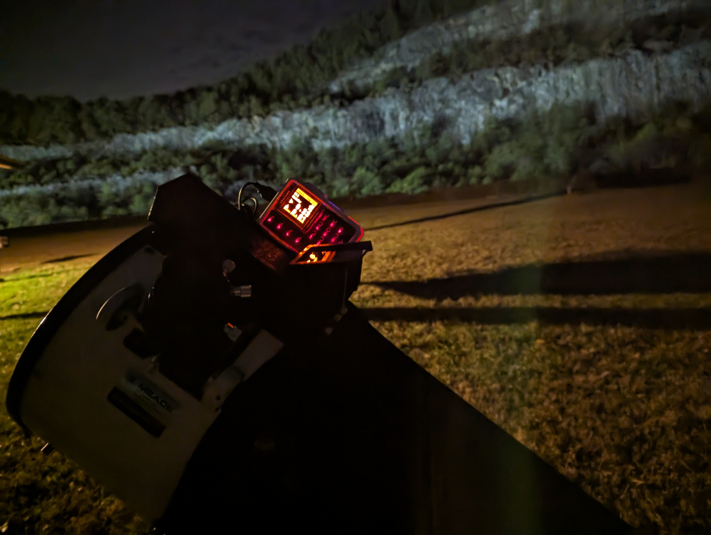

---

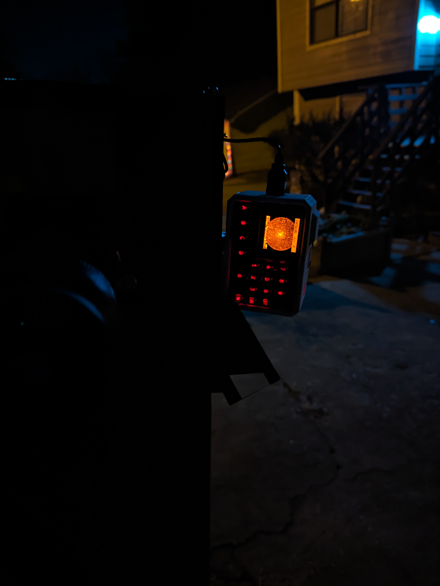

---

## What I Ordered


|  |  |  |
|--------|------|------|
| PCB componets from pifinder|$20| |
| DigiKey PCB Componets|$141.71| |
| Amazon PCB Componets|~$200| |

---

## Issues

 - I burned a PCB trace and my LED lights did not illuminate. I had to refer to the pcb diagram and wire in a jumper
 - I had horrible performance from the GPS module and eventually just kept the external one.

---

## Great for outreach!


---

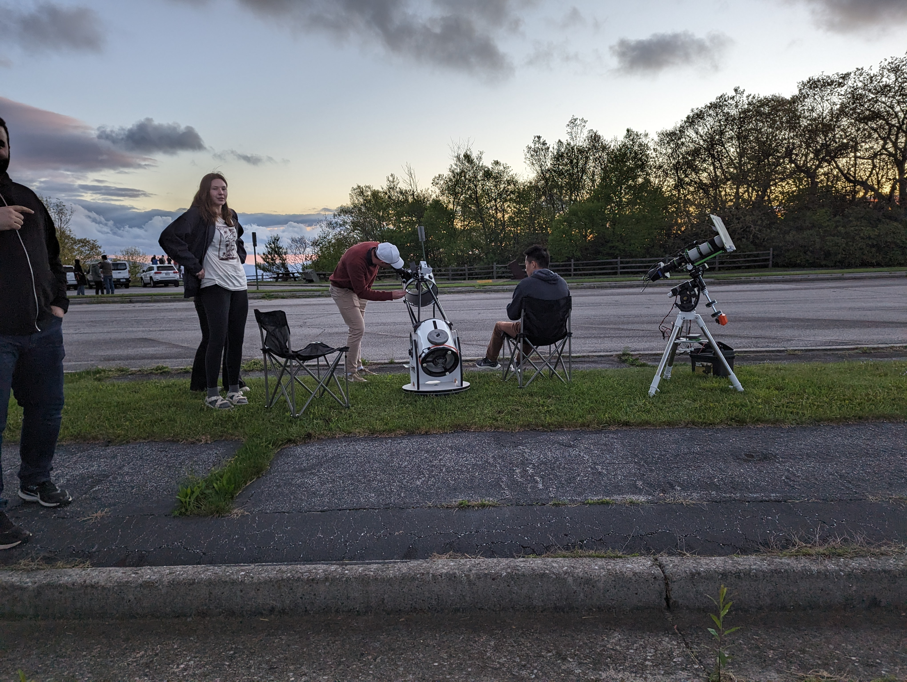

---

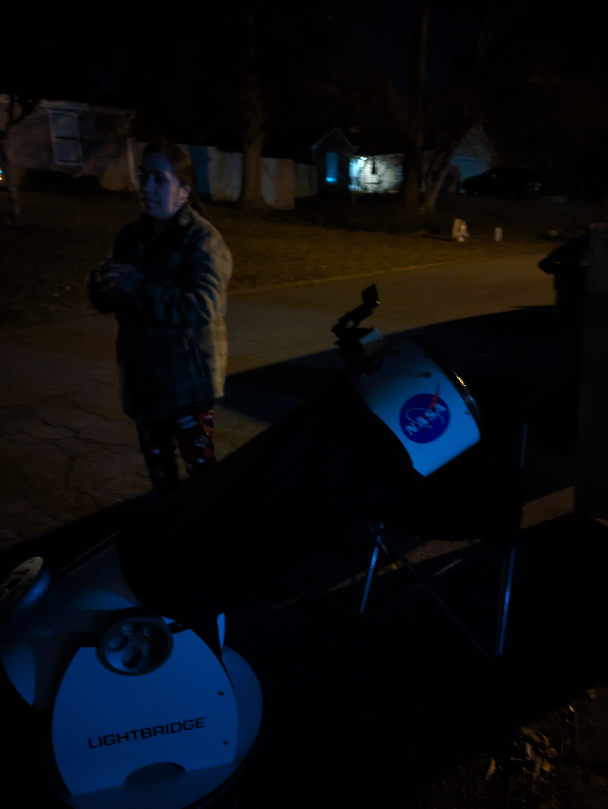

---

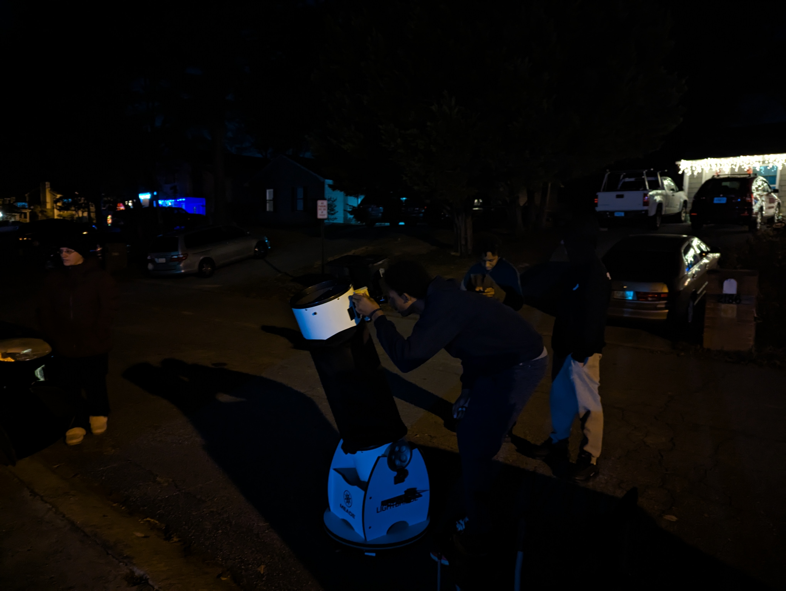

---

## How Plate Solving Works

*The math behind the magic*

How can we do plate solving multiple times a second on such low powered hardware?
---

## The Big Picture

Given a photo of a patch of sky, a plate solver complete the following:

- capture the picture
- know where it is in the world
- know the time
- extract out the star centers
- Look inside of its database to find the Right Ascension and the Declination 

---

## Step 1 — Star Extraction

Before we can identify the field, we need to find the stars.

**Find bright pixel clusters → compute their centroids (x, y positions)**

This is called **centroiding** — finding the precise center of each star's light blob.

Tools: `SExtractor`, `photutils DAOStarFinder`, or tetra3's built-in `get_centroids_from_image`

The result: a list of (x, y) pixel coordinates, sorted brightest first. That's all we need.


---

## Step 2 — Quad Formation

Take the brightest stars and form groups of **4 stars** (quads).

From 4 stars, compute the **6 pairwise distances** between every pair:

```
Stars A, B, C, D  →  AB, AC, AD, BC, BD, CD
```

With just 10 bright stars: **210 possible quads** to test.
With 8 stars: **70 quads** — fast and usually enough.

Why 4 stars? Three stars (triangles) are ambiguous — mirrored patterns look the same. Four stars breaks that symmetry.


---

## Step 3 — The Hash Code (The Fingerprint)

From those 6 distances, compute a **rotation- and scale-invariant fingerprint**:

1. Sort the distances largest → smallest
2. Divide each by the longest distance → ratios from 0 to 1
3. Those 5 ratios are your **hash code**

**Example:** Distances of 3', 2', 1', 0.7', 0.6', 0.5' → hash = `[1.0, 0.67, 0.33, 0.23, 0.20, 0.17]`

This fingerprint is identical regardless of:
- Image scale (zoom level, focal length)
- Image rotation (how the camera is oriented)
- Image flip (mirror)

<!--
Here's the clever part. We take those 6 distances and normalize them. The result is 5 ratios, all between 0 and 1. (The largest distance divided by itself is always 1.0, so we don't need to store it — just the other five.)

These 5 ratios are our hash code — the fingerprint of that star pattern.
-->

---

## Step 4 — Database Lookup

The star catalog (Hipparcos, Tycho, Gaia) has been pre-processed: every group of 4 bright stars has had its hash code computed and stored.

**To solve:** look up your image's hash codes in that pre-built database.

- Tolerance: ~0.007 (adjustable for lens distortion)
- Search strategy varies: ASTAP does a spiral search from a hint position; tetra3/cedar-solve searches the full database (lost-in-space)
- Match enough quads → you've identified the field


---


## The Lost-in-Space Advantage

**ASTAP** and most astrophotography solvers need a **rough starting RA/Dec** — they search near where you tell them to look.

**Tetra3 / cedar-solve** (what the PiFinder uses) need **nothing**. They search the entire database from scratch every time.

This was originally designed for **spacecraft attitude determination** — a satellite genuinely doesn't know where it's pointing when it first turns on its camera.

For visual observers, "lost-in-space" means:
- Power on and point at any patch of sky
- No alignment stars, no hint needed
- Works even if you accidentally knocked the scope across the yard

<!--
ASTAP and most astrophotography plate solvers need a rough starting position — they do a local search around where your mount says it's pointing. That works great for astrophotography where the mount always knows roughly where it's pointed.

But tetra3 and cedar-solve were designed for a different problem: spacecraft attitude determination. A satellite genuinely doesn't know where it's pointing when it first turns on its camera in orbit. There's no mount, no encoder, no prior. It has to work from first principles every single time.

For us as visual observers, this is a gift. There is literally no concept of setup or alignment. Point anywhere. Get an answer. Every time. The device can't get lost because it never relies on knowing where it was.

This is why I find the technology so cool — it was developed for spacecraft, open-sourced by ESA, and we're now using it in a $200 device mounted on a Dobsonian. That's remarkable.
-->

---

# Part 5
## How PiFinder Does It

*Tetra3, cedar-solve, and the IMU trick*
| Metric | Value |
|--------|-------|
| Solve time (Pi 5) | ~12 ms |
| Solve time (Pi Zero 2) | ~200 ms |
| Max solve rate | Up to 20 Hz continuous |
| Accuracy | ~10 arcseconds |
| Prior pointing needed | None |
<!--
PiFinder uses **cedar-solve** — a pip-installable fork of ESA's **tetra3** algorithm. Even at sub second solves, there's a gap between frames. While you're slewing the scope, position updates lag behind. The raspberry pi uses the built-in Inertial Measurement Unit to update its own location until the next solve gives it a good location

-->
---

## Lets make my telescope a giant fast solving efinder!


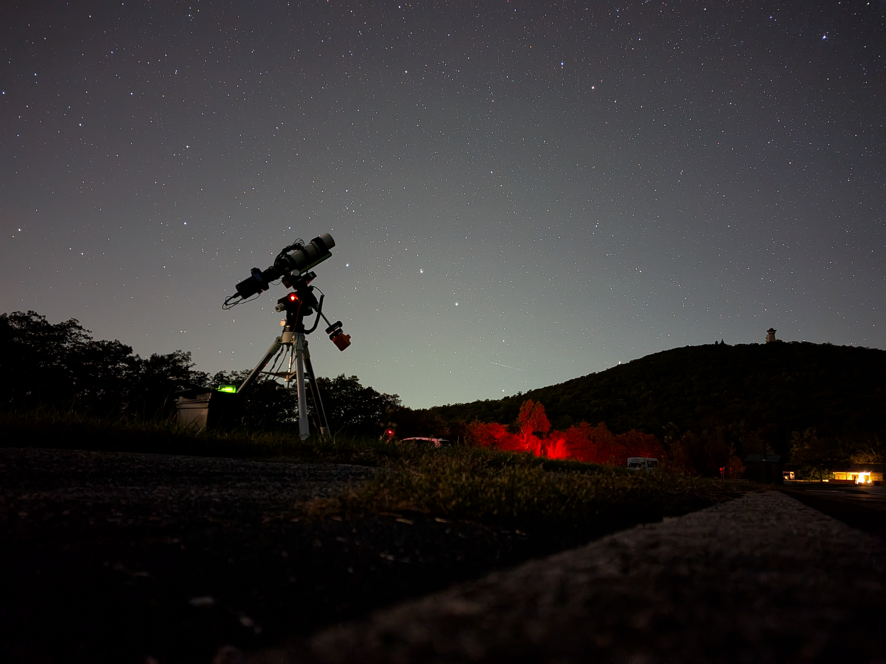

---

## Finding best variables for our particular telescope and camera

---

## LDN 889


<!--
By going thru our possible max area for individual stars, sigma which is a noise detection algorithm, background extraction modes we can start finding where our stars are. 
-->

---

## M 27


---

## M 42


---

## Using those variables to transform centroids to positions

---

## M42

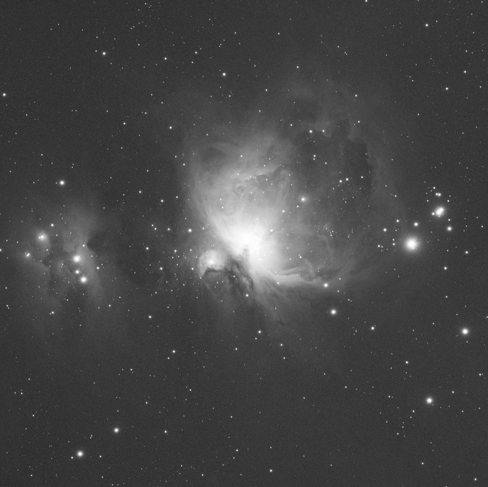

<!--
original picture
-->

---

## M42

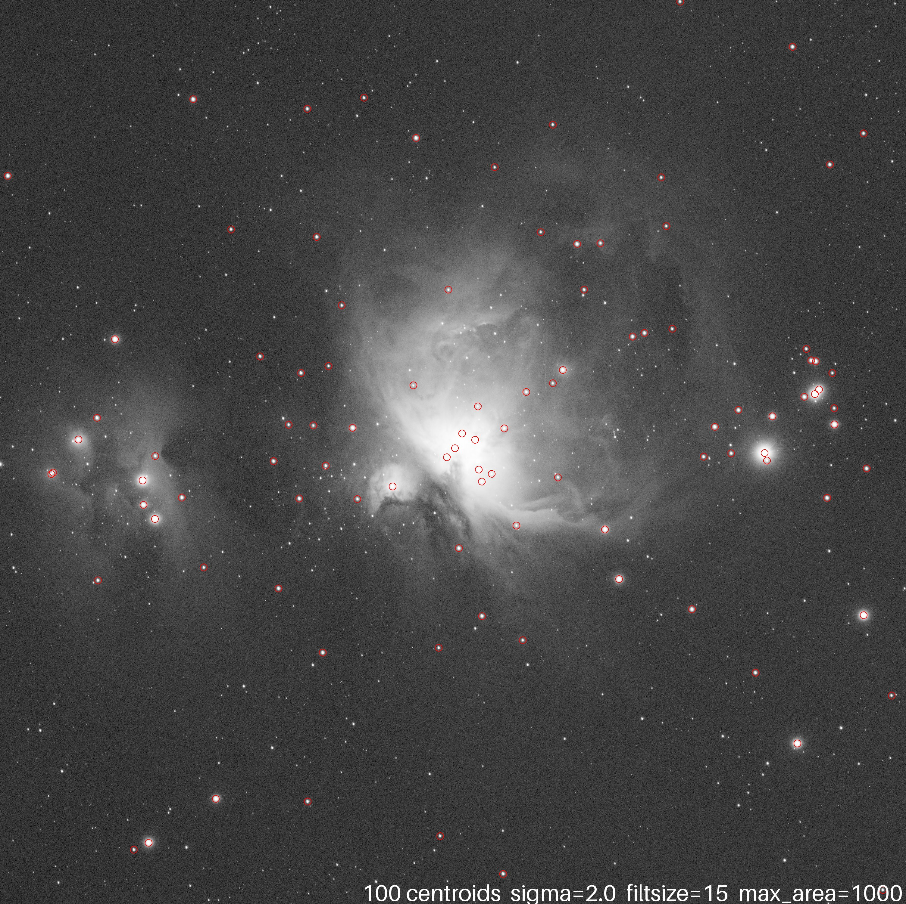

<!--
Top 100 centroids
-->

---

## M42

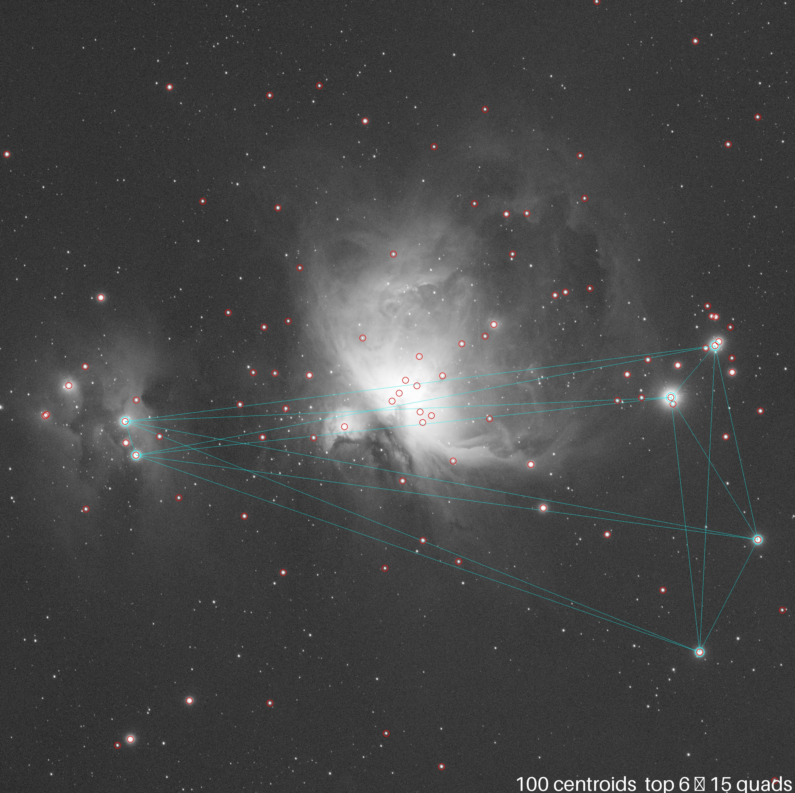

<!--
pick the top 6 brightest centroids and draw our shapes
-->

---

## M42

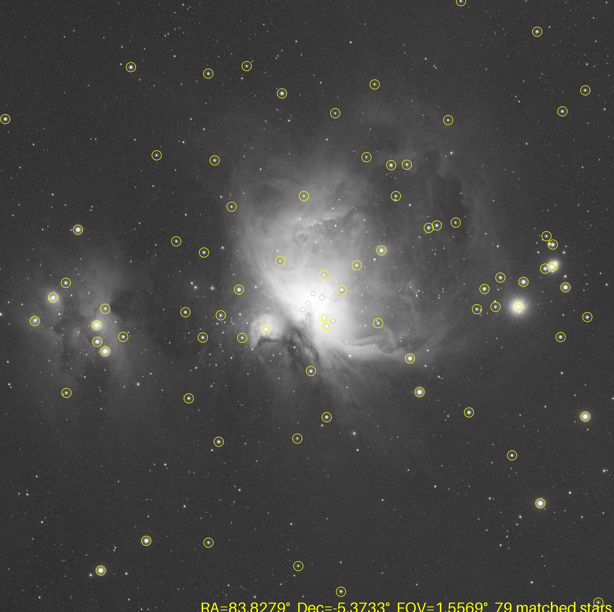

<!--
look up the hash in our database, library returns what centroids matched its database
-->

---

## M27


<!--
original picture
-->

---

## M27

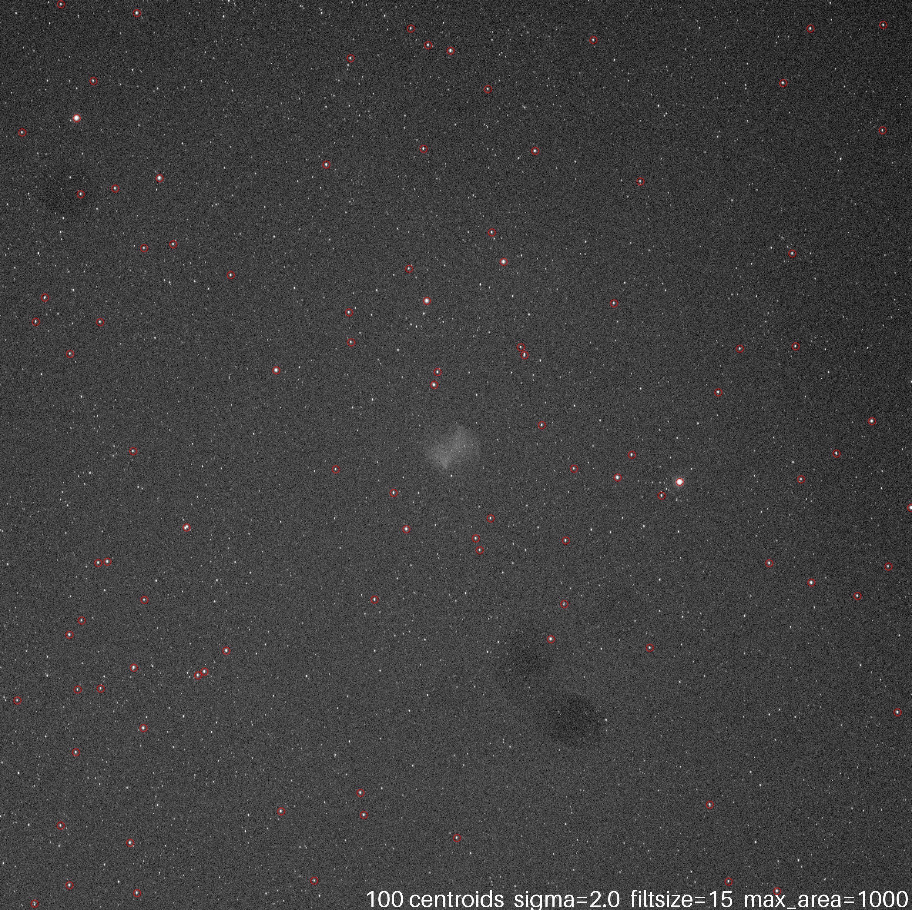

<!--
Top 100 centroids
-->

---

## M27


<!--
pick the top 6 brightest centroids and draw our shapes
-->

---

## M27

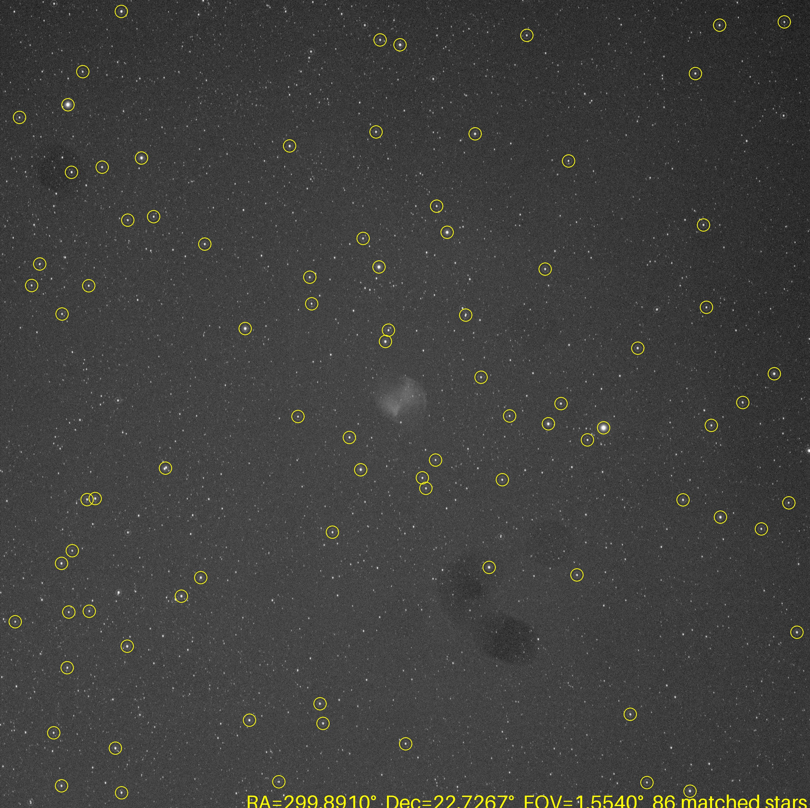

<!--
look up the hash in our database, library returns what centroids matched its database
-->

---

## M 97


<!--
original picture
-->

---

## M 97


<!--
Top 100 centroids
-->

---

## M 97

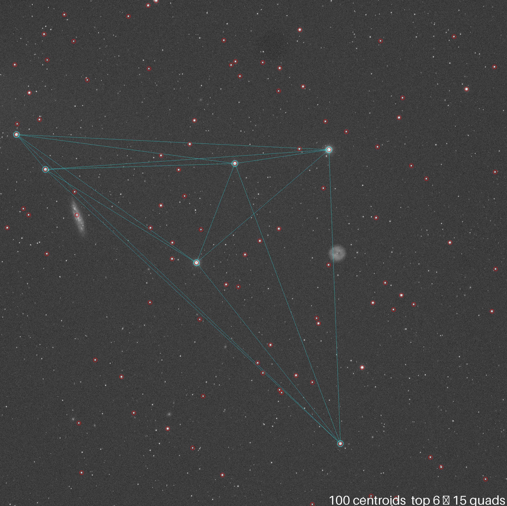

<!--
pick the top 6 brightest centroids and draw our shapes
-->

---

## M 97

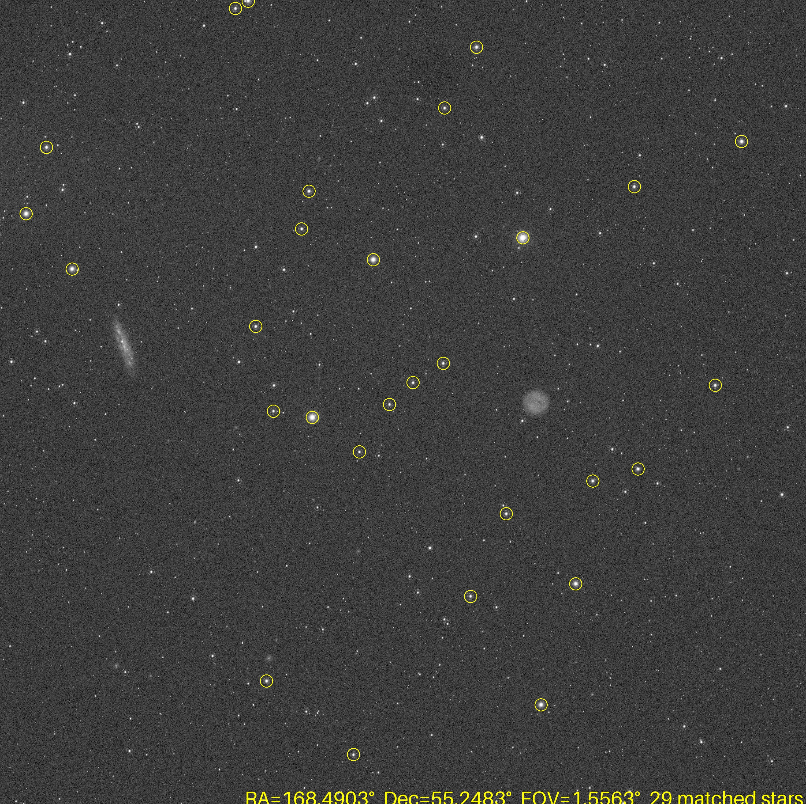

<!--
look up the hash in our database, library returns what centroids matched its database
-->

---


## Failed M42


<!--
original picture
-->

---

## Failed M42


<!--
Top 100 centroids
-->

---

## Failed M42


<!--
pick the top 6 brightest centroids and draw our shapes
-->

---

## Failed M42

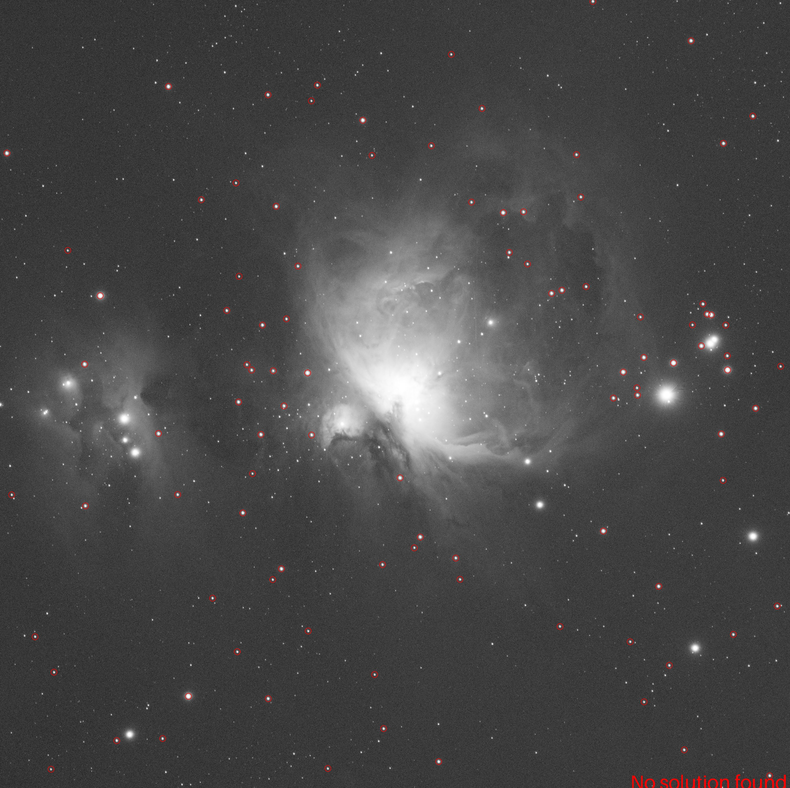

<!--
look up the hash in our database, library returns what centroids matched its database
-->

---

# Questions?

---

## Resources & Further Reading

**PiFinder**
- pifinder.io · github.com/brickbots/PiFinder
- Raspberry Pi blog: *Superior Stargazing with the PiFinder*

**Hopper eFinder**
- cs-astro.com · Cloudy Nights: *Introducing the Hopper e-Finder*

**Nexus eFinder**
- astrodevices.com/shop/nexus-efinder/

**Tetra3 / cedar-solve**
- github.com/esa/tetra3 · `pip install cedar-solve`
- tetra3.readthedocs.io

**DIY options**
- astrokeith.com/equipment/efinder/
- github.com/githubdoe/skysolve

<!--
Thank the club for having me, and mention you're happy to stay after and show the PiFinder in person.
-->
